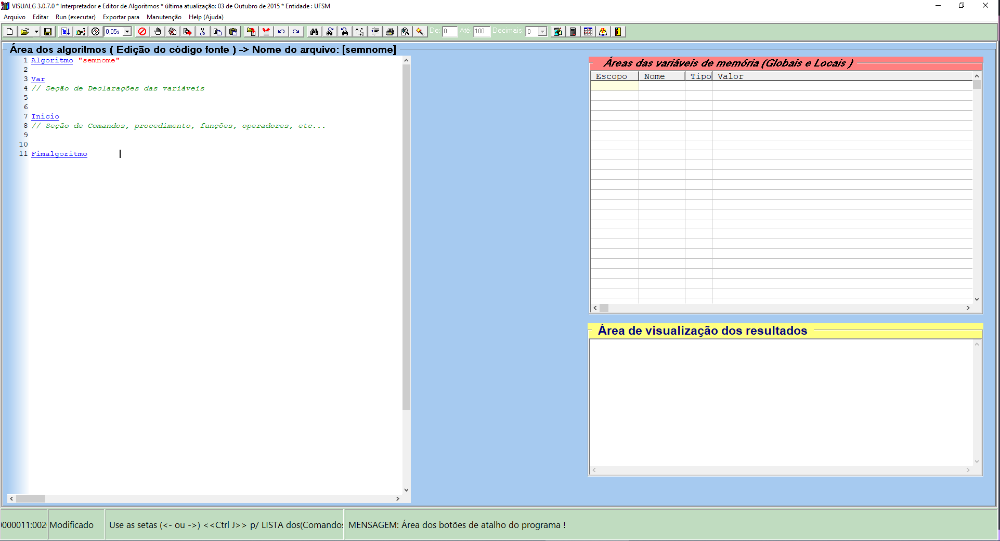

# visualg-instalador

## [O que é Visualg](https://sourceforge.net/projects/visualg30/)

Um software para criar, editar e interpretar algoritmos escritos em Portugol. É próprio para professores e para alunos iniciantes no mundo da Programação de computadores.

## Observação

- Não tenho qualquer vínculo com o desenvolvedor do software, apenas fiz o instalador do programa.
- Instale preferencialmente na área de trabalho ou na pasta de documentos.

## [Download](https://github.com/sganzerla/visualg-instalador/blob/main/dist/instalador.exe)

